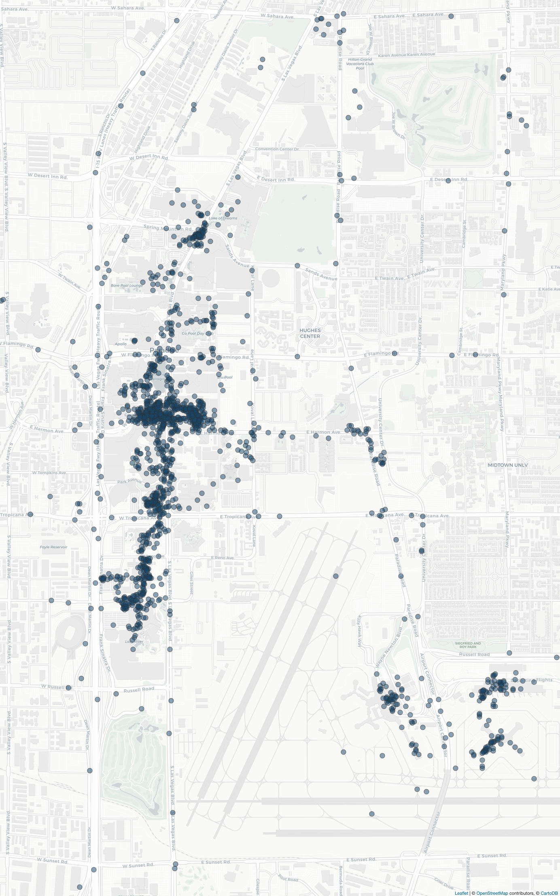

# About
#Getting Started
## Prerequisites
### Google Data
You'll need to get your Google location history manually for this to work. Go to https://takeout.google.com/settings/takeout
* Deselect everything
* Select "Location History"
* Click on Next Step
* Create Export
* Download the file
* Extract the Zip
* copy Takeout/Location History/Location History.json to the root of your project or use --google to give the path to the file
## usage
To run if you copied Location History.json to the root of your project:
```buildoutcfg
python3 where.py
```
If not 
```buildoutcfg
python3 where.py --google /path/to/Location History.json
```

Once the script has run open map.html to see a map of your location history.
